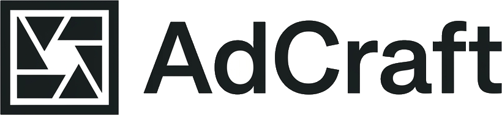
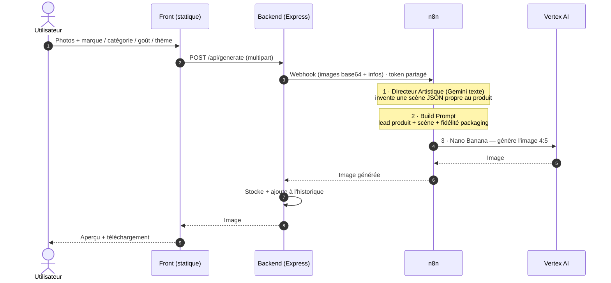
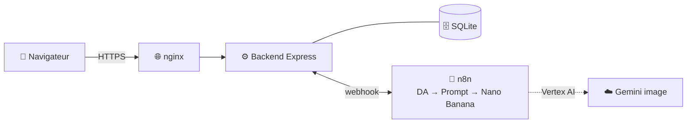

<p align="center">
  
</p>

<h1 align="center">AdCraft — Générateur de publicités IA</h1>

<p align="center">
  Vos produits, mis en scène comme en studio. Déposez une photo, choisissez un thème,<br/>
  obtenez un visuel <strong>4:5</strong> prêt à publier — <strong>sans jamais retoucher le packaging</strong>.
</p>

<p align="center">
  
  
  
  
  
  
  
  
  
</p>

---

Application web sur invitation pour générer des visuels publicitaires produit. L'utilisateur dépose des photos d'un produit, renseigne **marque / catégorie / goût (optionnel) / description (optionnel)**, choisit un **thème** (ou décrit lui-même le décor), et reçoit une publicité générée par **Gemini image (Nano Banana)** via **Vertex AI**, récupérable dans son **historique** avec téléchargement direct.

Le packaging (étiquette, logo, typo, couleurs) est repris **à l'identique** des photos ; seul le décor autour du produit est composé.

## Flux de génération



## Architecture



Le flux est **synchrone** : le backend attend la réponse de n8n (timeout ~120 s), écrit l'image et l'ajoute à l'historique. Priorité de décor dans **Build Prompt** : décor manuel saisi &gt; scène IA (Directeur Artistique) &gt; repli sur le preset du thème.

## Composants

| Rôle | Choix |
|---|---|
| Front | HTML + Tailwind **compilé** (`build:css`) + vanilla JS — `frontend/` |
| Backend | Node/Express + SQLite (better-sqlite3) — `backend/` |
| Logique de prompt | `shared/prompt.mjs` (source unique) → `tools/build-n8n.mjs` régénère le workflow |
| Orchestration | n8n — `n8n/generateur-publicite.json` |
| Génération image | Gemini image via **Vertex AI** — `gemini-3-pro-image` (par défaut) |
| Reverse proxy / TLS | nginx + Let's Encrypt — `nginx/` |

## Modèle & coût

Modèle image piloté par la variable d'environnement n8n **`GEMINI_MODEL`** (défaut `gemini-3-pro-image`) :
meilleur suivi d'instructions, fidélité du packaging et rendu du **texte d'emballage**, jusqu'à 14 images de référence.

| Résolution (`GEMINI_IMAGE_SIZE`) | Prix / image |
|---|---|
| 1K / 2K | ~$0.134 |
| 4K | ~$0.24 |

La résolution est réglée par **`GEMINI_IMAGE_SIZE`** (recommandé `2K` ; laisser vide pour `gemini-2.5-flash-image` qui ne la supporte pas). Le coût suivi côté app est `COST_PER_IMAGE_USD` (défaut `0.134`). À faible volume (~8-15 images/mois), ça reste sous ~1-2 €/mois.

> Alternative moins chère : `GEMINI_MODEL=gemini-2.5-flash-image` (~$0.039/image), sans `GEMINI_IMAGE_SIZE`.

## Prérequis

- Docker + Docker Compose (déploiement) **ou** Node.js 18+ et n8n (dev)
- Un **projet Google Cloud** avec l'API **Vertex AI** activée + un **compte de service** (clé JSON) — le workflow appelle `aiplatform.googleapis.com`
- (Prod) un domaine pointant sur le serveur, pour le TLS

> `docker-compose.yml` ne lance **pas** n8n : il réutilise une instance n8n existante (ex. sur le VPS), atteinte via `N8N_WEBHOOK_URL`.

## Installation (Docker)

```bash
git clone https://github.com/Cvandeput/ad-generator.git
cd ad-generator

cp .env.example .env
# Éditer .env : SESSION_SECRET, N8N_TOKEN, N8N_WEBHOOK_URL, DOMAIN, SEED_USERS

docker compose up -d --build
```

Sur votre instance **n8n** (une seule fois) :

1. **Credentials → New → Google API** (compte de service) : coller la clé JSON du service account (cf. `sa-key.json`).
2. Variables d'environnement n8n : `GCP_PROJECT`, `GEMINI_MODEL=gemini-3-pro-image`, `GEMINI_IMAGE_SIZE=2K`, `GEMINI_TEXT_MODEL` (défaut `gemini-2.5-flash`), `WEBHOOK_TOKEN` (= `N8N_TOKEN`).
3. **Workflows → Import from File** → `n8n/generateur-publicite.json`.
4. Sur les nodes **Directeur Artistique** et **Nano Banana (Vertex)**, sélectionner la credential Google créée à l'étape 1.
5. **Activer** le workflow.

L'app est servie par nginx sur `http://localhost` (port 80).

### TLS en production

```bash
certbot certonly --webroot -w ./frontend -d votre-domaine.tld
# puis décommenter le bloc HTTPS dans nginx/default.conf + le volume certbot dans docker-compose.yml
docker compose restart nginx
```

## Installation (dev local, sans Docker)

```bash
# backend (sert aussi le front en dev, seed les comptes SEED_USERS)
cd backend
npm install
# .env à la racine : N8N_WEBHOOK_URL=http://localhost:5678/webhook/generate-ads
npm start          # http://localhost:3000

# front : recompiler le CSS après une modif de classes Tailwind
cd frontend && npm run build:css   # (ou watch:css)
```

Ouvrir `http://localhost:3000` → page de connexion. Après toute modif de `shared/prompt.mjs` : `node tools/build-n8n.mjs` puis réimporter le workflow.

## Utilisation

1. **Se connecter** (accès sur invitation — comptes définis dans `SEED_USERS`).
2. **Déposer** de 1 à 14 photos (chaque photo peut être un produit différent : ils apparaissent tous).
3. Renseigner **Marque**, **Catégorie**, **Goût** (optionnel), **Description** (optionnel).
4. Choisir un **thème** : Classique · Été · Extravagant · Sport · Nuit · Luxe · Noël — ou déplier *Précisez le décor souhaité* pour écrire le décor.
5. **Générer** → l'image s'affiche et apparaît dans l'historique.
6. **Télécharger** depuis le résultat ou l'historique.

Exemple : `Red Bull` · `boisson énergisante` · `pêche` · thème *Été*.

## Thèmes / presets

La logique de prompt (presets, fidélité, interdits) vit dans **`shared/prompt.mjs`** (source unique). Le workflow n8n en est la copie générée par `tools/build-n8n.mjs`. Pour ajouter/ajuster un thème : éditer `PRESETS`/`THEMES` dans `shared/prompt.mjs` + `frontend/js/components.js` (`THEMES`) + la liste blanche dans `backend/src/routes/generate.js`, puis régénérer le workflow.

## API backend

| Méthode | Route | Description |
|---|---|---|
| POST | `/api/auth/login` | Connexion |
| POST | `/api/auth/logout` | Déconnexion |
| GET | `/api/auth/me` | Utilisateur courant |
| POST | `/api/generate` | Générer (multipart : `images[]`, `brand`, `category`, `flavor`, `theme`, `description`, `art_direction`) |
| POST | `/api/generation/:id/retry` | Relancer une génération échouée |
| DELETE | `/api/generation/:id` | Supprimer une génération |
| GET | `/api/history` | Historique du compte (`?status=done\|error\|all`) |
| GET | `/api/usage` | Consommation (mois courant / total) |
| GET | `/api/image/:id` | Image générée (`?download=1` pour forcer le téléchargement) |

> Un endpoint `/api/auth/register` existe encore côté backend mais n'est plus exposé dans l'UI (accès sur invitation).

## Sécurité

- Identifiants Google (service account) **uniquement** dans n8n (credential), jamais dans le repo ni le front. `sa-key.json` est gitignoré.
- Mots de passe hachés (bcrypt), cookie de session `httpOnly` + `secure` (prod) + `sameSite`.
- Rate-limit sur l'auth et la génération, en-têtes helmet + nginx.
- Webhook n8n protégé par token partagé (`N8N_TOKEN` / `WEBHOOK_TOKEN`).
- `.env` et `backend/data/` sont gitignorés.

## Structure

```
backend/         Express + SQLite (auth, historique, proxy n8n)
frontend/        index.html, login.html, app.html, history.html, css/, js/, img/ (dont img/site = exemples avant/après)
shared/          prompt.mjs (source unique de la logique de prompt)
tools/           build-n8n.mjs (régénère le workflow), test-gemini.mjs
n8n/             generateur-publicite.json (workflow)
nginx/           default.conf (proxy + TLS)
docker-compose.yml, .env.example
```

## Dépannage

- **502 à la génération** → workflow n8n non activé, credential Google absente/invalide, ou API Vertex AI non activée. Voir les exécutions dans l'UI n8n.
- **Délai dépassé** → augmenter `N8N_TIMEOUT_MS` et le `timeout` du node HTTP.
- **Cookie non conservé en prod** → `NODE_ENV=production` requis (cookie `secure`) + accès en HTTPS (ou `SESSION_COOKIE_SECURE=false` en HTTP local).
- **`Vertex/Gemini: aucune image renvoyée`** → vérifier le modèle (`GEMINI_MODEL`), `responseModalities: ['TEXT','IMAGE']` et la credential sur le node **Nano Banana (Vertex)**.

## Auteur

**Vandeput Corentin** — [devworks.be](https://devworks.be) · vdp.corentin@gmail.com

## License

MIT
