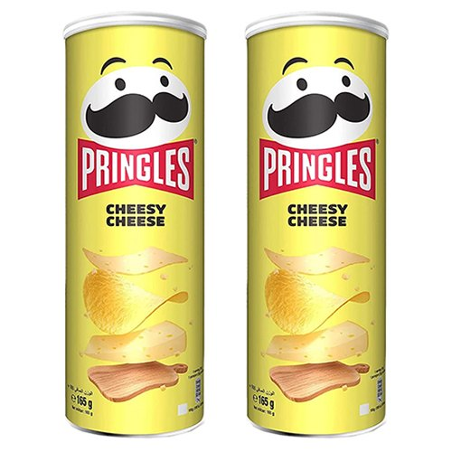
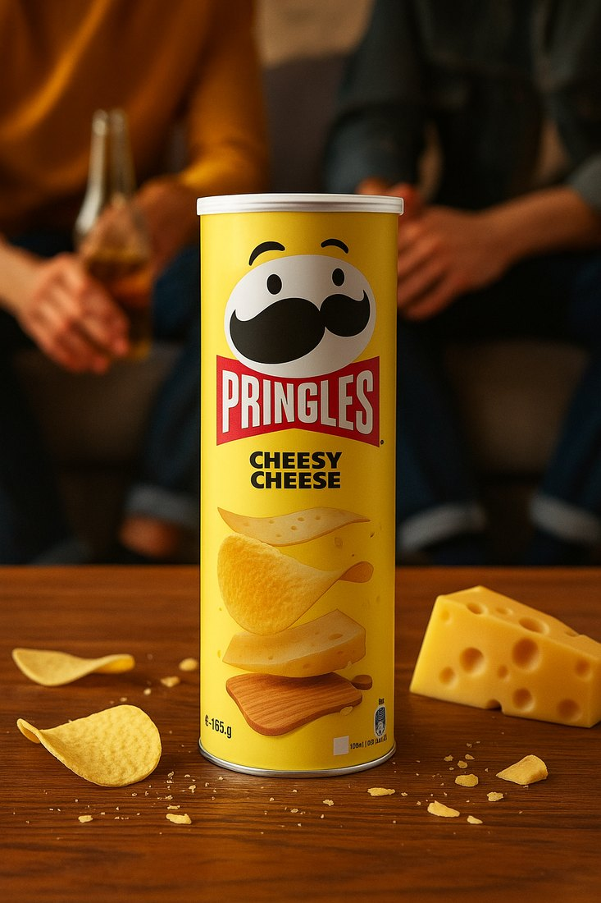
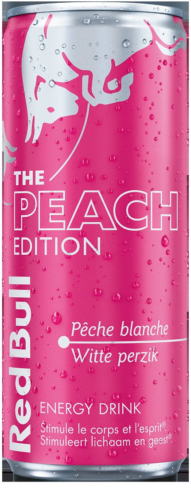
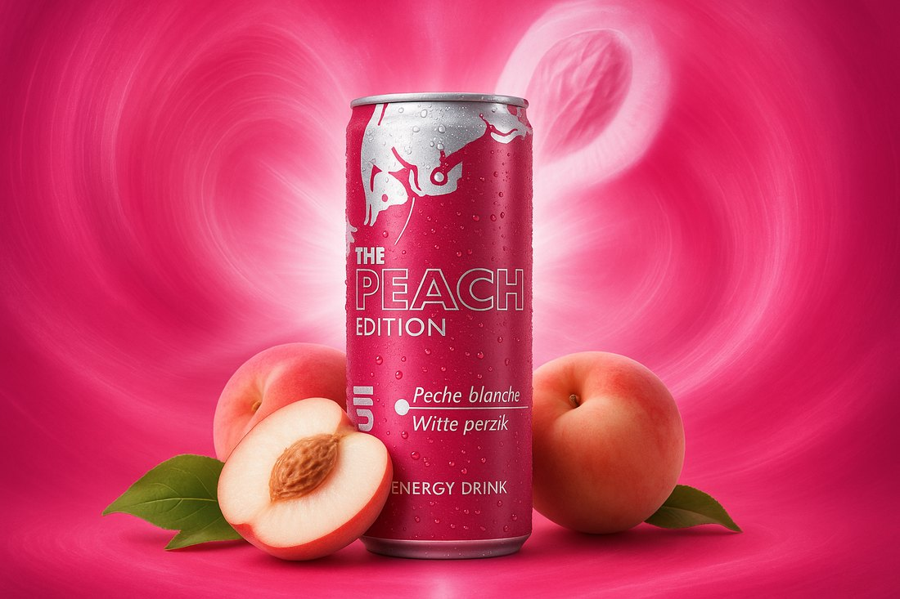

# Générateur de Publicités IA avec n8n

> **🚧 Work in progress** — projet mis en pause, reprise en cours. Le pipeline d'analyse et de génération fonctionne (voir les exemples réels plus bas), mais la stack est en cours de migration vers du 100 % open source et local. Ne pas considérer les instructions d'installation comme définitives.

Automatisation de la génération de visuels publicitaires : une photo produit brute en entrée, des visuels publicitaires exploitables en sortie, livrés par email.

[](https://n8n.io)
[](https://ollama.com)
[](LICENSE)

---

## Résultats

Photos produit brutes (packshot e-commerce, fond blanc) → visuels générés, sans retouche manuelle.

### Pringles Cheesy Cheese

| Entrée | Sortie |
|:---:|:---:|
|  |  |
| Packshot catalogue | Mise en scène lifestyle, lumière chaude, contexte de consommation |

### Red Bull The Peach Edition

| Entrée | Sortie |
|:---:|:---:|
|  |  |
| Packshot fond blanc | Fond radial signature, ingrédients mis en avant, condensation ajoutée |

Le modèle conserve le packaging, la typographie et l'identité de marque, et reconstruit uniquement l'environnement.

---

## Vue d'ensemble

```
📸 Upload image → 🧠 Analyse produit (VLM) → 🎨 Génération visuelle → 📧 Envoi email
```

L'utilisateur dépose une photo produit sur une page web et reçoit par email plusieurs propositions publicitaires. Tout tourne en local : pas de clé API, pas de rate limiting, pas de données envoyées à un tiers.

## Fonctionnalités

- Upload multi-images via interface web
- Analyse produit par modèle vision local (description, thème, palette, tagline, prompt de génération)
- Génération de plusieurs variantes par produit
- Email automatique avec les visuels en HD
- 100 % local, 100 % open source
- Support JPG, PNG, WebP

## Architecture

```
┌─────────────────┐
│   Page Web      │
│   + Upload      │
└────────┬────────┘
         │ POST /webhook
         ▼
┌─────────────────┐
│   n8n Webhook   │
│   (validation)  │
└────────┬────────┘
         │
         ▼
┌──────────────────────┐
│  Ollama — Qwen3-VL   │  analyse du produit
│  (vision, local)     │  → JSON structuré
└────────┬─────────────┘
         │ prompt de génération
         ▼
┌──────────────────────┐
│  ComfyUI             │  génération image-to-image
│  Qwen-Image 2.0      │  (référence = photo produit)
└────────┬─────────────┘
         │ N images
         ▼
┌─────────────────┐
│  Email (SMTP)   │
└─────────────────┘
```

## Stack

| Rôle | Choix | Licence | VRAM (Q4/fp8) |
|---|---|---|---|
| Orchestration | [n8n](https://n8n.io) | Sustainable Use | — |
| Analyse vision | [Qwen3-VL-8B](https://ollama.com) via Ollama | Apache 2.0 | ~6 Go |
| Analyse vision (petite config) | Qwen3-VL-4B | Apache 2.0 | ~3,5 Go |
| Génération d'image | [Qwen-Image 2.0](https://github.com/QwenLM) via ComfyUI | Apache 2.0 | ~8–12 Go |
| Alternative génération | FLUX.2 `schnell` | Apache 2.0 | ~13 Go |

> **Changement de stack.** La v1 utilisait `llama3.2-vision` pour l'analyse et l'API tierce Laozhang pour la génération — donc une clé API payante et une dépendance externe. Les deux sont remplacés : Qwen3-VL surclasse nettement llama3.2-vision en compréhension d'image, et Qwen-Image 2.0 tourne en local sous Apache 2.0, sans restriction commerciale. FLUX.2 est une alternative valable pour l'édition multi-références, mais seule la variante `schnell` est libre — la variante `dev` est non commerciale.

## Prérequis

- Node.js 18+ (ou Docker)
- [Ollama](https://ollama.com/download)
- [ComfyUI](https://github.com/comfyanonymous/ComfyUI) avec l'API activée
- GPU ~12 Go de VRAM recommandé (les deux modèles ne tournent pas simultanément)

## Installation

```bash
git clone https://github.com/Cvandeput/ad-generator.git
cd ad-generator
```

### n8n

```bash
npm install -g n8n && n8n start
# ou
docker run -it --rm --name n8n -p 5678:5678 -v ~/.n8n:/home/node/.n8n n8nio/n8n
```

### Modèle vision

```bash
ollama pull qwen3-vl:8b     # ou qwen3-vl:4b sur petite config
ollama serve
```

### Modèle de génération

Installer ComfyUI, placer les poids Qwen-Image 2.0 dans `models/`, démarrer avec `--listen` pour exposer l'API sur `http://localhost:8188`.

### Import du workflow

n8n → menu ☰ → **Import from File** → `generateur-publicite.json`.

## Configuration

`.env` :

```env
N8N_HOST=localhost
N8N_PORT=5678

OLLAMA_HOST=http://localhost:11434
OLLAMA_MODEL=qwen3-vl:8b

COMFYUI_HOST=http://localhost:8188
COMFYUI_WORKFLOW=workflows/qwen-image-i2i.json

EMAIL_SERVICE=smtp
EMAIL_USER=votre.email@gmail.com
EMAIL_FROM=Générateur Publicités <votre.email@gmail.com>
```

Aucune clé API n'est nécessaire — c'est le but.

**SMTP Gmail** : hôte `smtp.gmail.com`, port `587`, et un *app password*, pas le mot de passe du compte.

**Webhook** : `http://localhost:5678/webhook/generate-ads`. Pour un accès externe, `ngrok http 5678`.

## Utilisation

1. Déployer `ad-generator.html` et y renseigner l'URL du webhook.
2. L'utilisateur upload sa photo, saisit son email, valide.
3. Il reçoit les visuels par email.

Test manuel :

```bash
curl -X POST http://localhost:5678/webhook/generate-ads \
  -H "Content-Type: application/json" \
  -d '{
    "email": "test@example.com",
    "ctaClicked": true,
    "images": [{ "data": "BASE64", "name": "produit.jpg", "source": "cta_upload" }]
  }'
```

### Sortie de l'analyse vision

```json
{
  "productDescription": "Boîte de chips Pringles Cheesy Cheese, 165 g, packaging jaune",
  "adTheme": "convivialité, apéro entre amis",
  "tagline": "Le goût qui rassemble",
  "visualConcept": "Boîte posée sur une table en bois, chips éparpillées, arrière-plan flou avec deux personnes",
  "colorPalette": "Jaune saturé, brun bois, rouge Pringles",
  "generationPrompt": "Product advertisement photography, Pringles can on wooden table..."
}
```

## Reste à faire

- [ ] Migrer les nodes de génération de Laozhang vers l'API ComfyUI
- [ ] Workflow ComfyUI image-to-image versionné dans le repo
- [ ] Générer N variantes en une seule passe
- [ ] Template email HTML responsive
- [ ] Gestion d'erreurs et retry sur timeout GPU
- [ ] Mesurer le temps de génération réel par image

## Troubleshooting

**Ollama ne répond pas** — `ollama serve`, puis `curl http://localhost:11434/api/version`.

**Model not found** — `ollama list`, puis `ollama pull qwen3-vl:8b`.

**Webhook n8n muet** — vérifier que le workflow est activé (toggle en haut à droite), pas seulement sauvegardé.

**Génération qui échoue** — vérifier la VRAM disponible : Ollama et ComfyUI chargés simultanément saturent un GPU 12 Go. Décharger le modèle vision avant la génération.

**Email non reçu** — vérifier les spams et l'app password SMTP.

## License

MIT — voir [LICENSE](LICENSE).

## Auteur

**Vandeput Corentin** — [devworks.be](https://devworks.be) · vdp.corentin@gmail.com
